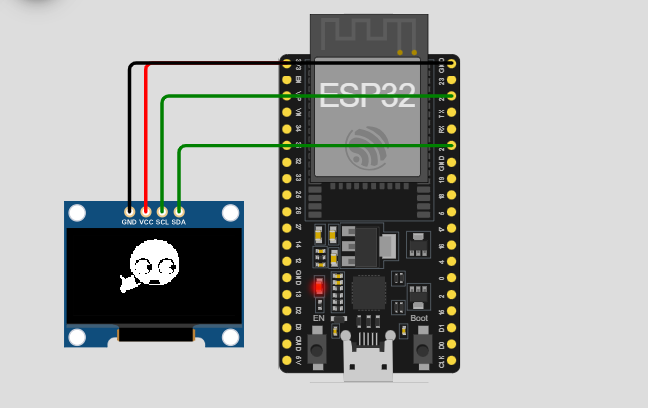

# Welcome guys haha
## Ini cuman project seru2an aja wkwkwk

# ESP32 + OLED SSD1306 Video Animation (Velocity Display)

## Library yang Harus Diinstal

(`Sketch > Include Library > Manage Libraries`):

<table>
  <thead>
    <tr>
      <th>Library Name</th>
      <th>Fungsi</th>
      <th>Link</th>
    </tr>
  </thead>
  <tbody>
    <tr>
      <td>Adafruit GFX Library</td>
      <td>Menyediakan fungsi grafis seperti <code>drawBitmap</code></td>
      <td><a href="https://github.com/adafruit/Adafruit-GFX-Library" target="_blank">Adafruit GFX</a></td>
    </tr>
    <tr>
      <td>Adafruit SSD1306</td>
      <td>Mengontrol layar OLED SSD1306 via I2C</td>
      <td><a href="https://github.com/adafruit/Adafruit_SSD1306" target="_blank">Adafruit SSD1306</a></td>
    </tr>
    <tr>
      <td>Wire (Built-in)</td>
      <td>Komunikasi I2C untuk ESP32</td>
      <td>Sudah tersedia di Arduino IDE</td>
    </tr>
  </tbody>
</table>

⚠️ **Catatan:**  
Library `Adafruit BusIO` biasanya otomatis terinstal bersama library di atas. Kalo error, install manual dari Library Manager.

---

## Ringkasan Pin ESP32 ↔ OLED SSD1306

<table>
  <thead>
    <tr>
      <th>Komponen</th>
      <th>ESP32 DevKit V1 Pin</th>
      <th>OLED SSD1306 Pin</th>
      <th>Fungsi</th>
    </tr>
  </thead>
  <tbody>
    <tr>
      <td>Power</td>
      <td><b>3V3</b></td>
      <td><b>VCC</b></td>
      <td>Power Supply</td>
    </tr>
    <tr>
      <td>Ground</td>
      <td><b>GND</b></td>
      <td><b>GND</b></td>
      <td>Ground</td>
    </tr>
    <tr>
      <td>I2C Data</td>
      <td><b>GPIO 21 (SDA)</b></td>
      <td><b>SDA</b></td>
      <td>Data I2C</td>
    </tr>
    <tr>
      <td>I2C Clock</td>
      <td><b>GPIO 22 (SCL)</b></td>
      <td><b>SCL</b></td>
      <td>Clock I2C</td>
    </tr>
  </tbody>
</table>

---

## 📚 Referensi

- <a href="https://github.com/espressif/arduino-esp32" target="_blank">ESP32 Arduino Core</a>
- <a href="https://wokwi.com" target="_blank">Wokwi ESP32 Simulator</a>
